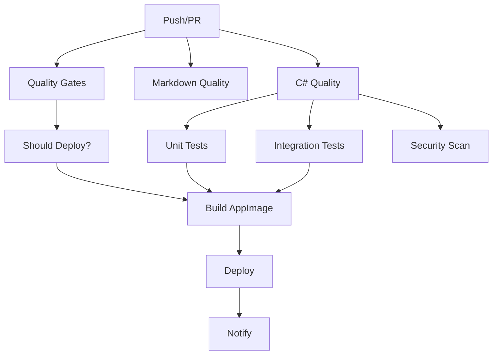

# Overlay Companion (MCP) - Tool Specification
[](https://sheld.io) [](https://github.com/danielrosehill/Vibe-Coded-Disclosure)

<!-- markdownlint-disable MD051 -->
<!-- toc -->
- [Architecture Overview](#architecture-overview)
  - [System Components (Current - KasmVNC Architecture)](#system-components-current-kasmvnc-architecture)
    - [Core Architecture (Simplified)](#core-architecture-simplified)
    - [Security Architecture (Enhanced)](#security-architecture-enhanced)
    - [Network Architecture](#network-architecture)
    - [Target Protocol Support](#target-protocol-support)
  - [Deployment Architecture](#deployment-architecture)
    - [Container-Based Deployment (Current - KasmVNC)](#container-based-deployment-current-kasmvnc)
    - [Quality Assurance & Security](#quality-assurance-security)
- [Pre-commit Hooks Configuration](#pre-commit-hooks-configuration)
  - [Python Code Quality](#python-code-quality)
  - [File Validation](#file-validation)
  - [Language-Specific Formatting](#language-specific-formatting)
  - [Build and Deployment Validation](#build-and-deployment-validation)
  - [Documentation Quality](#documentation-quality)
  - [Security Analysis (CodeQL-like)](#security-analysis-codeql-like)
  - [Git Commit Standards](#git-commit-standards)
  - [Security Hook Details](#security-hook-details)
- [ESLint security (auto-installed)](#eslint-security-auto-installed)
- [Semgrep (auto-installed)](#semgrep-auto-installed)
- [Spell checking](#spell-checking)
  - [Container Build Considerations](#container-build-considerations)
  - [HTTP Transport Benefits](#http-transport-benefits)
- [MCP Tool Specification (JSON Format)](#mcp-tool-specification-json-format)
- [Detailed Tool Descriptions](#detailed-tool-descriptions)
  - [1. draw_overlay](#1-drawoverlay)
  - [2. remove_overlay](#2-removeoverlay)
  - [3. take_screenshot](#3-takescreenshot)
  - [4. click_at](#4-clickat)
  - [5. type_text](#5-typetext)
  - [6. set_mode](#6-setmode)
  - [7. set_screenshot_frequency](#7-setscreenshotfrequency)
  - [8. get_clipboard](#8-getclipboard)
  - [9. set_clipboard](#9-setclipboard)
  - [10. batch_overlay](#10-batchoverlay)
  - [11. subscribe_events](#11-subscribeevents)
  - [12. unsubscribe_events](#12-unsubscribeevents)
- [Error Handling](#error-handling)
- [Security & Safety](#security-safety)
  - [Human-in-the-Loop Controls](#human-in-the-loop-controls)
  - [Privacy & Networking](#privacy-networking)
  - [Platform Integration](#platform-integration)
    - [Linux: Wayland-first with X11 fallback](#linux-wayland-first-with-x11-fallback)
    - [General](#general)
- [Implementation Roadmap](#implementation-roadmap)
  - [High Priority (Core Functionality)](#high-priority-core-functionality)
  - [Medium Priority (Enhanced Features)](#medium-priority-enhanced-features)
  - [Low Priority (Polish)](#low-priority-polish)
- [Versioning Schema](#versioning-schema)
  - [Format: `YYYY.MM.DD[.N]`](#format-yyyymmddn)
  - [Examples](#examples)
  - [Release Automation](#release-automation)
- [GitHub Actions & CI/CD](#github-actions-cicd)
  - [1. **Markdown Linting** (`markdown-lint.yml`)](#1-markdown-linting-markdown-lintyml)
  - [2. **C# Linting** (`csharp-lint.yml`)](#2-c-linting-csharp-lintyml)
  - [3. **AppImage Build** (`build-appimage.yml`)](#3-appimage-build-build-appimageyml)
  - [4. **CI/CD Pipeline** (`ci-cd.yml`)](#4-cicd-pipeline-ci-cdyml)
  - [Workflow Dependencies](#workflow-dependencies)
  - [Quality Standards](#quality-standards)
  - [CI/CD Best Practices & Timeout Management](#cicd-best-practices-timeout-management)
    - [Multi-Layered Timeout Strategy](#multi-layered-timeout-strategy)
    - [Timeout Configuration by Workflow](#timeout-configuration-by-workflow)
    - [Error Classification & Recovery](#error-classification-recovery)
    - [Resource Management](#resource-management)
    - [Monitoring & Observability](#monitoring-observability)
- [Packaging Artifacts & Ignored Paths](#packaging-artifacts-ignored-paths)
- [AI GUI Tests (AllHands-only)](#ai-gui-tests-allhands-only)
- [Appendix: MCP specification (consolidated)](#appendix-mcp-specification-consolidated)
- [Overlay Companion (MCP) - MCP Protocol Specification](#overlay-companion-mcp-mcp-protocol-specification)
- [Overview & Purpose](#overview-purpose)
  - [Design Principles](#design-principles)
  - [Extension Strategy](#extension-strategy)
- [MCP Protocol Implementation](#mcp-protocol-implementation)
  - [Server Information](#server-information)
  - [Capabilities](#capabilities)
  - [Error Handling](#error-handling-1)
  - [Rate Limiting](#rate-limiting)
  - [Security Model](#security-model)
  - [Authentication & Credentials](#authentication-credentials)
  - [Operational Modes](#operational-modes)
- [Connection Configuration](#connection-configuration)
  - [Cherry Studio Configuration (HTTP Transport - Recommended)](#cherry-studio-configuration-http-transport-recommended)
  - [Configuration Helper Endpoints](#configuration-helper-endpoints)
- [Modes and Safety](#modes-and-safety)
  - [Claude Desktop Configuration (HTTP Transport - Recommended)](#claude-desktop-configuration-http-transport-recommended)
  - [Legacy STDIO Configuration (Deprecated)](#legacy-stdio-configuration-deprecated)
- [Operational Modes](#operational-modes-1)
- [Tools](#tools)
  - [1. draw_overlay](#1-drawoverlay-1)
  - [2. remove_overlay](#2-removeoverlay-1)
  - [3. take_screenshot](#3-takescreenshot-1)
  - [4. click_at](#4-clickat-1)
  - [5. type_text](#5-typetext-1)
  - [6. set_mode](#6-setmode-1)
  - [7. set_screenshot_frequency](#7-setscreenshotfrequency-1)
  - [8. get_clipboard](#8-getclipboard-1)
  - [9. set_clipboard](#9-setclipboard-1)
  - [10. batch_overlay](#10-batchoverlay-1)
  - [11. subscribe_events](#11-subscribeevents-1)
  - [12. unsubscribe_events](#12-unsubscribeevents-1)
  - [13. re_anchor_element](#13-reanchorelement)
  - [14. get_display_info](#14-getdisplayinfo)
- [Operational Modes](#operational-modes-2)
- [Rate Limiting](#rate-limiting-1)
- [Privacy and Security](#privacy-and-security)
- [Multi-Monitor Support](#multi-monitor-support)
- [Performance Considerations](#performance-considerations)
- [Context Awareness](#context-awareness)
- [Development Environment](#development-environment)
  - [For AI Agents and AllHands Instances](#for-ai-agents-and-allhands-instances)
  - [Quality Standards](#quality-standards-1)
  - [Documentation](#documentation)
  - [Build and Deployment](#build-and-deployment)
<!-- tocstop -->
<!-- markdownlint-enable MD051 -->

_A general-purpose, human-in-the-loop AI-assisted screen interaction toolkit._

---

## Architecture Overview

The Overlay Companion MCP is a containerized system that provides AI-assisted screen interaction through a **simplified multi-container architecture**. The system is built using the **official ModelContextProtocol C# SDK** with HTTP transport and deployed via Docker Compose/Podman for reliable container orchestration.


### System Components (Current - KasmVNC Architecture)

```text
AI Client → HTTP/MCP → Caddy Proxy → {MCP Server, Web Interface, KasmVNC} → VM
                           ↓
                    Web UI Configuration (No Database)
```

#### Core Architecture (Simplified)

1. **Container Stack** (Docker/Podman) - **4 Containers** (33% reduction):
   - **MCP Server Container**: C# application with HTTP transport, overlay tools, screen capture, KasmVNC integration
   - **Web Interface Container**: Node.js frontend with overlay visualization, connection management, and credential handling
   - **KasmVNC Container**: Web-native VNC server with multi-monitor support and WebSocket/WebRTC protocols
   - **Caddy Proxy**: Unified access point routing to all services

2. **Configuration Layer** (No Database Required):
   - **YAML-based configuration**: Simple file-based setup eliminates PostgreSQL complexity
   - **Environment variable credentials**: Secure credential injection via container environment
   - **Web UI credential management**: Browser-based connection management with encrypted localStorage
   - **Multi-VM configuration**: Web browser UI for managing multiple VM connections (not Docker config)

3. **Network Architecture**:
   - **Configurable ports**: All service ports configurable during installation
   - **Default ports**: Main interface (8080), MCP server (3000), KasmVNC (6901), Web interface (8082)
   - **Port conflict resolution**: Automatic detection with interactive alternatives
   - Caddy proxy as unified access point routing to all services
   - Internal container networking with service discovery
   - **Enhanced WebSocket support**: Real-time overlay events and KasmVNC communication

#### Security Architecture (Enhanced)

- **CWE Vulnerability Protection**: Comprehensive fixes for Common Weakness Enumeration vulnerabilities
  - **CWE-79 (XSS)**: DOMPurify + he libraries for client-side, DOMPurify + JSDOM + validator.js for server-side
  - **CWE-116 (Improper Encoding)**: Multi-layer HTML entity encoding using validator.js and DOMPurify
  - **CWE-307 (Rate Limiting)**: Tiered rate limiting with express-rate-limit (100/15min general, 10/15min filesystem)
- **SSRF Protection**: Comprehensive Server-Side Request Forgery protection with multiple validation layers
- **POST over GET**: Network requests use POST method with fixed URL paths to prevent URL-based attacks
- **Host Validation**: Multi-layer host validation with allowlist/blocklist patterns
- **Input Sanitization**: Multi-layer sanitization using industry-standard security libraries
  - **Client-side**: DOMPurify v3.0.5 + he v1.2.0 for XSS prevention
  - **Server-side**: DOMPurify + JSDOM + validator.js v13.11.0 for comprehensive validation
- **Type Safety**: Explicit type checking before string operations to prevent type confusion attacks
- **Security Headers**: Helmet.js with Content Security Policy and comprehensive HTTP security headers
- **Rate Limiting**: Multi-tiered rate limiting system (general, filesystem, WebSocket, health endpoints)
- **No Database Attack Surface**: Elimination of PostgreSQL removes SQL injection and database compromise risks

#### Network Architecture

- **Default**: Host-only access (localhost) for security
- **Optional**: LAN exposure with security warnings
- **Output**: Non-localhost IP URL (e.g., http://192.168.1.42:8080)

#### Target Protocol Support

The system supports connecting to target desktops using three different protocols. The MCP server can configure and manage these connections programmatically, while the web interface provides manual configuration options.

**Supported Protocols:**

| Protocol | Description | Authentication | Multi-Monitor | Recommended Use |
|----------|-------------|----------------|---------------|-----------------|
| **KasmVNC** | Web-native VNC with modern WebSocket/WebRTC | Password-only or Username+Password | ✅ Full support with independent browser windows | **Recommended** - Best for multi-monitor setups, modern web-native protocol |
| **Standard VNC** | Traditional VNC servers (TigerVNC, RealVNC, etc.) | Password-only (username optional) | ⚠️ Limited - Single canvas display | Legacy VNC servers, single monitor setups |
| **RDP** | Windows Remote Desktop Protocol | **Username+Password required** | ✅ Supported (Windows 7+ Enterprise/Ultimate) | Windows targets, enterprise environments |

**Protocol-Specific Details:**

1. **KasmVNC (Recommended)**
   - **Port**: 6901 (default)
   - **Authentication**: Flexible (password-only or username+password)
   - **Multi-Monitor**: True multi-monitor support via independent browser windows
   - **Technology**: Modern WebSocket/WebRTC protocols
   - **Advantages**: No database required, best performance, web-native

2. **Standard VNC**
   - **Port**: 5900-5909 (typical VNC ports)
   - **Authentication**: Password-only (username optional depending on server)
   - **Multi-Monitor**: Limited to single canvas (all monitors merged)
   - **Compatibility**: Works with TigerVNC, RealVNC, TightVNC, x11vnc, etc.

3. **RDP (Remote Desktop Protocol)**
   - **Port**: 3389 (default)
   - **Authentication**: **Username AND password required** (not optional)
   - **Multi-Monitor**: Supported on Windows 7 Ultimate/Enterprise or later
   - **Configuration**: Requires full-screen mode for multi-monitor
   - **Use Case**: Windows Server, Windows Enterprise desktops

**Connection Configuration:**

Connections can be configured in two ways:

1. **Web Interface** (Manual): Users configure connections via browser at `http://localhost:8080`
   - Stored in browser's encrypted localStorage
   - Supports multiple VM connections
   - Interactive connection testing

2. **MCP Server** (Programmatic): AI agents can configure connections via MCP tools
   - Allows dynamic connection management
   - Enables AI-driven target selection
   - Supports automated testing and validation

**Important Notes:**
- **Authentication Requirements**: RDP always requires both username and password, while VNC protocols can work with password-only authentication
- **Multi-Monitor Limitations**: For true multi-monitor support, KasmVNC is strongly recommended
- **Protocol Selection**: The MCP server respects protocol-specific requirements and will validate credentials accordingly

### Deployment Architecture

#### Container-Based Deployment (Current - KasmVNC)

```text
host-setup-kasmvnc.sh → Podman Compose → {4 Containers} → Web Interface + MCP Server
```

**Container Stack (Simplified):**
- **kasmvnc**: Web-native VNC server with multi-monitor support
- **mcp-server**: C# MCP server with HTTP transport and KasmVNC integration
- **overlay-web**: Node.js web interface with connection management
- **caddy**: Reverse proxy and load balancer

**Deployment Process:**
1. `host-setup-kasmvnc.sh` installs Podman and dependencies
2. **Port configuration**: Interactive setup with conflict resolution
3. **Environment variable credentials**: Simple VNC_PASSWORD and KASM_PASSWORD setup
4. Builds custom MCP server and web interface containers
5. Configures KasmVNC with YAML-based settings
6. **No database initialization required** - eliminates PostgreSQL complexity
7. Starts all containers with proper networking and environment variables

**Access Points:**
- **Main Interface**: http://localhost:8080 (Caddy proxy) - *configurable*
- **MCP Server**: http://localhost:3000 (direct access) - *configurable*
- **KasmVNC**: http://localhost:6901 (web-native interface) - *configurable*
- **Web Interface**: http://localhost:8080/ (connection management) - *configurable*
- **Multi-VM Configuration**: Web browser UI for managing connections (not Docker config)

#### Quality Assurance & Security

**Pre-commit Checks:**
- **Python**: Black formatting, isort imports, flake8 linting, bandit security scanning
- **C#**: dotnet-format code formatting and style validation
- **JavaScript Security**: ESLint with security plugins for SSRF, injection, and vulnerability detection
- **Multi-language Security**: Semgrep static analysis (CodeQL alternative) for JavaScript, TypeScript, and C#
- **CWE Vulnerability Detection**: Enhanced security scanning for Common Weakness Enumeration vulnerabilities
  - **CWE-79 (XSS)**: Detection of unsafe innerHTML usage and missing sanitization
  - **CWE-116 (Improper Encoding)**: Validation of HTML entity encoding implementation
  - **CWE-307 (Rate Limiting)**: Verification of rate limiting middleware configuration
  - **Type Confusion**: Detection of unsafe type operations and parameter tampering
- **Markdown**: markdownlint formatting with auto-fix
- **Spelling**: cspell spell checking for documentation with security library terms
- **Credential Security**: detect-secrets for credential scanning with allowlist for development passwords
- **YAML/JSON**: Syntax validation for configuration files
- **Git**: Conventional commit message validation

**GitHub Actions Security:**
- **CodeQL**: Comprehensive static analysis for security vulnerabilities detecting CWE-79, CWE-116, CWE-307
- **Container Security**: Vulnerability scanning for container images with Trivy
- **Dependency Scanning**: Automated dependency vulnerability detection for security libraries
- **SSRF Protection**: Multiple validation layers prevent Server-Side Request Forgery attacks

**Security Analysis Coverage:**
- **Pre-commit**: ESLint security rules + Semgrep static analysis for immediate CWE vulnerability feedback
- **GitHub Actions**: Full CodeQL analysis for comprehensive security scanning with CWE classification
- **Combined Coverage**: Local security checks catch common issues, CodeQL provides deep CWE analysis
- **CodeQL-like Functionality**: Semgrep provides CodeQL-equivalent security analysis in pre-commit hooks
- **Security Library Validation**: Automated testing of DOMPurify, validator.js, and security middleware

**Security Implementation:**
- **POST over GET**: Network requests use POST method with fixed URL paths
- **Host Validation**: Multi-layer validation with allowlist/blocklist patterns

**Security Dependencies & Libraries:**

*Client-side Security (Web Interface):*
```json
{
  "dompurify": "^3.0.5",
  "he": "^1.2.0"
}
```

*Server-side Security (MCP Server):*
```json
{
  "express-rate-limit": "^7.1.5",
  "helmet": "^7.1.0",
  "express-validator": "^7.0.1",
  "validator": "^13.11.0",
  "dompurify": "^3.0.5",
  "jsdom": "^23.0.1"
}
```

**Security Library Functions:**
- **DOMPurify**: HTML sanitization preventing XSS attacks (CWE-79)
- **he**: HTML entity encoding for safe text rendering (CWE-116)
- **validator.js**: Comprehensive input validation and sanitization
- **express-rate-limit**: Rate limiting middleware preventing abuse (CWE-307)
- **helmet.js**: Security headers and Content Security Policy
- **express-validator**: Request validation middleware with type safety
- **JSDOM**: Server-side DOM implementation for DOMPurify

**Security Middleware**: Centralized security utilities implemented in `release/containers/server/middleware/security.js` providing:
- Input validation with type safety
- Path traversal protection with encoded path detection
- Rate limiting configurations for different endpoint types
- Sanitization functions using DOMPurify and validator.js

**Security Documentation**: See [SECURITY.md](SECURITY.md) for comprehensive security policy, implementation details, and vulnerability reporting procedures.

## Pre-commit Hooks Configuration

The project uses comprehensive pre-commit hooks to ensure code quality, security, and consistency. Install with:

```bash
pip install pre-commit
pre-commit install
```

### Python Code Quality

| Hook | Purpose | Configuration |
|------|---------|---------------|
| **black** | Code formatting | Python 3, line length 88 |
| **isort** | Import sorting | Black-compatible profile |
| **flake8** | Linting | Max line 88, ignore E203/W503 |
| **bandit** | Security scanning | JSON output, excludes tests |

### File Validation

| Hook | Purpose | Files |
|------|---------|-------|
| **trailing-whitespace** | Remove trailing spaces | All except .md |
| **end-of-file-fixer** | Ensure newline at EOF | All except .md |
| **check-yaml** | YAML syntax validation | .yaml, .yml |
| **check-json** | JSON syntax validation | .json |
| **check-toml** | TOML syntax validation | .toml |
| **check-xml** | XML syntax validation | .xml |
| **check-merge-conflict** | Detect merge conflicts | All files |
| **check-case-conflict** | Case sensitivity issues | All files |
| **check-added-large-files** | Prevent large files | Max 1MB |
| **detect-private-key** | Prevent key commits | All files |

### Language-Specific Formatting

| Hook | Purpose | Configuration |
|------|---------|---------------|
| **dotnet-format** | C# code formatting | Minimal verbosity |

### Build and Deployment Validation

| Hook | Purpose | Validation |
|------|---------|------------|
| **check-build-scripts-executable** | Script permissions | scripts/*.sh executable |
| **validate-appimage-if-exists** | AppImage integrity | Runs validation if AppImage exists |
| **check-workflow-syntax** | GitHub Actions YAML | Syntax validation |
| **check-npm-cache-config** | npm configuration | Cache/package.json consistency |

### Documentation Quality

| Hook | Purpose | Configuration |
|------|---------|---------------|
| **markdownlint** | Markdown linting | Auto-fix enabled |
| **cspell** | Spell checking | Custom dictionary, .md files |

### Security Analysis (CodeQL-like)

| Hook | Purpose | Coverage |
|------|---------|----------|
| **eslint-security** | JavaScript security | SSRF, XSS, injection detection |
| **semgrep-security** | Multi-language static analysis | Format strings, insecure transport, WebSocket security |
| **detect-secrets** | Secret detection | Excludes .lock, .min.js, .min.css |

### Git Commit Standards

| Hook | Purpose | Format |
|------|---------|--------|
| **conventional-pre-commit** | Commit message format | feat, fix, docs, style, refactor, test, chore, ci |

### Security Hook Details

**ESLint Security Analysis:**
- Detects SSRF vulnerabilities
- Identifies XSS injection points (CWE-79)
- Validates object injection sinks
- Checks for unsafe regex patterns
- Monitors format string vulnerabilities
- Validates DOMPurify usage patterns
- Detects missing HTML entity encoding (CWE-116)

**Semgrep Security Analysis:**
- Multi-language security scanning (JS, TS, C#)
- Detects insecure transport (HTTP vs HTTPS)
- Identifies insecure WebSocket connections
- Validates PostMessage origin handling
- Checks for CSRF protection
- Analyzes innerHTML usage for XSS risks (CWE-79)
- Validates rate limiting implementation (CWE-307)
- Detects type confusion vulnerabilities
- Monitors security library usage (DOMPurify, validator.js, helmet.js)

**Installation Requirements:**
```bash
## ESLint security (auto-installed)
cd infra/server
npm install --no-save eslint@8 eslint-plugin-security

## Semgrep (auto-installed)
pip install semgrep

## Spell checking
npm install -g cspell
```
- **Input Sanitization**: Character filtering and normalization
- **Rate Limiting**: Connection testing limited to 10 requests/minute per IP

#### Container Build Considerations

**Build Context & File Transfer:**
- **Docker Context**: All builds use root directory (`.`) as context for consistency
- **Multi-stage Builds**: Separate build and runtime stages for optimal image size
- **Layer Caching**: Package files copied separately from source code for better cache utilization
- **Fallback Mechanisms**: `npm ci || npm install` pattern handles missing package-lock.json gracefully

**Cross-Platform Compatibility:**
- **Multi-architecture**: AMD64 and ARM64 builds for broad compatibility
- **Alpine Linux Base**: Minimal attack surface with apk package manager
- **Node.js LTS**: Stable Node.js 20-alpine for web interface builds
- **.NET 8**: Latest LTS runtime for MCP server container

**Build Robustness:**
- **Explicit File Copying**: Individual package.json and package-lock.json copies prevent context issues
- **Verbose Logging**: `--verbose` flags for debugging build failures in CI/CD
- **Error Handling**: Graceful fallbacks when npm ci fails (falls back to npm install)
- **Security Scanning**: Trivy integration for vulnerability detection

**GitHub Actions Integration:**
- **Build Matrix**: Parallel builds for both MCP server and web interface containers
- **Cache Optimization**: GitHub Actions cache for Docker layers and npm packages
- **Registry Publishing**: Automated publishing to GitHub Container Registry (GHCR)
- **Version Tagging**: Date-based versioning (YYYY.MM.DD.quantity) with Git tag creation

### HTTP Transport Benefits

The native HTTP transport provides critical advantages for modern MCP deployments:

1. **Image Support**: Native handling of images and binary data (STDIO cannot handle images)
2. **Multi-Client Support**: Multiple AI clients can connect simultaneously
3. **Web Integration**: Direct browser access and web-based tooling
4. **Streaming**: Server-Sent Events for real-time updates
5. **Remote Deployment**: MCP server can run on different machines/containers
6. **Monitoring**: HTTP traffic can be logged, monitored, and audited
7. **Load Balancing**: Multiple MCP server instances with standard HTTP load balancers
8. **CORS Support**: Cross-origin requests for web applications

---

## MCP Tool Specification (JSON Format)

```json
{
  "mcp_spec_version": "1.0",
  "name": "overlay-companion-mcp",
  "description": "Public MCP server exposing overlay, screenshot, and input actions for human-in-the-loop UI automation.",
  "tools": [
    {
      "id": "draw_overlay",
      "title": "Draw overlay box",
      "mode": "async",
      "params": {
        "x": { "type": "number" },
        "y": { "type": "number" },
        "width": { "type": "number" },
        "height": { "type": "number" },
        "color": { "type": "string", "optional": true },
        "opacity": { "type": "number", "optional": true, "description": "0.0 to 1.0 (default 0.5)" },
        "label": { "type": "string", "optional": true },
        "temporary_ms": { "type": "number", "optional": true }
      },
      "returns": {
        "overlay_id": "string",
        "bounds": { "x": "number", "y": "number", "width": "number", "height": "number" },
        "monitor_index": "number"
      }
    },
    {
      "id": "remove_overlay",
      "title": "Remove overlay",
      "mode": "sync",
      "params": {
        "overlay_id": { "type": "string" }
      },
      "returns": {
        "removed": "boolean",
        "not_found": "boolean"
      }
    },
    {
      "id": "take_screenshot",
      "title": "Take screenshot",
      "mode": "async",
      "params": {
        "region": { "type": "object", "optional": true },
        "full_screen": { "type": "boolean", "optional": true },
        "scale": { "type": "number", "optional": true },
        "wait_for_stable_ms": { "type": "number", "optional": true }
      },
      "returns": {
        "image_base64": "string",
        "width": "number",
        "height": "number",
        "region": "object",
        "monitor_index": "number",
        "display_scale": "number",
        "viewport_scroll": { "x": "number", "y": "number" }
      }
    },
    {
      "id": "click_at",
      "title": "Simulate click",
      "mode": "sync",
      "params": {
        "x": { "type": "number" },
        "y": { "type": "number" },
        "button": { "type": "string", "enum": ["left","right","middle"], "optional": true },
        "clicks": { "type": "number", "optional": true },
        "require_user_confirmation": { "type": "boolean", "optional": true },
        "action_timing_hint": { "type": "object", "optional": true }
      },
      "returns": {
        "success": "boolean",
        "was_confirmed": "boolean"
      }
    },
    {
      "id": "type_text",
      "title": "Emulate typing",
      "mode": "async",
      "params": {
        "text": { "type": "string" },
        "typing_speed_wpm": { "type": "number", "optional": true },
        "require_user_confirmation": { "type": "boolean", "optional": true },
        "action_timing_hint": { "type": "object", "optional": true }
      },
      "returns": {
        "success": "boolean",
        "typed_length": "number"
      }
    },
    {
      "id": "set_mode",
      "title": "Set operational mode",
      "mode": "sync",
      "params": {
        "mode": { "type": "string", "enum": ["passive","assist","autopilot","composing","custom"] },
        "metadata": { "type": "object", "optional": true }
      },
      "returns": {
        "ok": "boolean",
        "active_mode": "string"
      }
    },
    {
      "id": "set_screenshot_frequency",
      "title": "Set screenshot frequency",
      "mode": "sync",
      "params": {
        "mode": { "type": "string" },
        "interval_ms": { "type": "number" },
        "only_on_change": { "type": "boolean", "optional": true }
      },
      "returns": {
        "ok": "boolean",
        "applied_interval_ms": "number"
      }
    },
    {
      "id": "get_clipboard",
      "title": "Get clipboard",
      "mode": "sync",
      "params": {},
      "returns": {
        "text": "string",
        "available": "boolean"
      }
    },
    {
      "id": "set_clipboard",
      "title": "Set clipboard",
      "mode": "sync",
      "params": {
        "text": { "type": "string" }
      },
      "returns": {
        "ok": "boolean"
      }
    },
    {
      "id": "batch_overlay",
      "title": "Draw multiple overlays",
      "mode": "async",
      "params": {
        "overlays": {
          "type": "array",
          "items": {
            "type": "object",
            "properties": {
              "x": { "type": "number" },
              "y": { "type": "number" },
              "width": { "type": "number" },
              "height": { "type": "number" },
              "color": { "type": "string", "optional": true },
              "opacity": { "type": "number", "optional": true, "description": "0.0 to 1.0 (default 0.5)" },
              "label": { "type": "string", "optional": true },
              "temporary_ms": { "type": "number", "optional": true },
              "click_through": { "type": "boolean", "optional": true },
              "monitor_index": { "type": "number", "optional": true }
            }
          }
        },
        "one_at_a_time": { "type": "boolean", "optional": true }
      },
      "returns": {
        "overlay_ids": "array"
      }
    },
    {
      "id": "subscribe_events",
      "title": "Subscribe to UI events",
      "mode": "async",
      "params": {
        "events": { "type": "array", "items": { "type": "string" } },
        "debounce_ms": { "type": "number", "optional": true },
        "filter": { "type": "object", "optional": true }
      },
      "returns": {
        "subscription_id": "string",
        "subscribed": "array"
      }
    },
    {
      "id": "unsubscribe_events",
      "title": "Unsubscribe from events",
      "mode": "sync",
      "params": {
        "subscription_id": { "type": "string" }
      },
      "returns": {
        "ok": "boolean"
      }
    }
  ]
}
```

---

## Detailed Tool Descriptions

### 1. draw_overlay

**Purpose**: Draw a visual overlay box on the screen for highlighting or annotation.

**Parameters**:

- `x` (number, required): X coordinate in screen pixels
- `y` (number, required): Y coordinate in screen pixels
- `width` (number, required): Width of overlay in pixels
- `height` (number, required): Height of overlay in pixels
- `color` (string, optional): Color name or hex code (default: "red")
- `label` (string, optional): Text label to display on overlay
- `temporary_ms` (number, optional): Auto-remove after milliseconds

**Returns**:

- `overlay_id`: Unique identifier for the created overlay
- `bounds`: Actual bounds of the overlay (may be adjusted for screen boundaries)
- `monitor_index`: Index of the monitor where overlay was placed

**Example**:

```json
{
  "method": "draw_overlay",
  "params": {
    "x": 100,
    "y": 200,
    "width": 300,
    "height": 50,
    "color": "blue",
    "label": "Click here",
    "temporary_ms": 5000
  }
}
```

### 2. remove_overlay

**Purpose**: Remove a previously created overlay by its ID.

**Parameters**:

- `overlay_id` (string, required): ID of overlay to remove

**Returns**:

- `removed`: True if overlay was successfully removed
- `not_found`: True if overlay ID was not found

### 3. take_screenshot

**Purpose**: Capture a screenshot of the screen or a specific region.

**Parameters**:
- `region` (object, optional): Specific region to capture `{x, y, width, height}`
- `full_screen` (boolean, optional): Capture entire screen (default: true)
- `scale` (number, optional): Scale factor for image (default: 1.0)
- `wait_for_stable_ms` (number, optional): Wait for UI to stabilize before capture

**Returns**:
- `image_base64`: Base64-encoded PNG image data
- `width`: Image width in pixels
- `height`: Image height in pixels
- `region`: Actual captured region
- `monitor_index`: Monitor that was captured
- `display_scale`: Display scaling factor
- `viewport_scroll`: Current scroll position if applicable

### 4. click_at

**Purpose**: Simulate a mouse click at specified coordinates.

**Parameters**:
- `x` (number, required): X coordinate to click
- `y` (number, required): Y coordinate to click
- `button` (string, optional): Mouse button ("left", "right", "middle", default: "left")
- `clicks` (number, optional): Number of clicks (default: 1)
- `require_user_confirmation` (boolean, optional): Require user confirmation
- `action_timing_hint` (object, optional): Timing hints for the action

**Returns**:
- `success`: True if click was executed successfully
- `was_confirmed`: True if user confirmation was required and given

### 5. type_text

**Purpose**: Simulate keyboard typing of text.

**Parameters**:
- `text` (string, required): Text to type
- `typing_speed_wpm` (number, optional): Typing speed in words per minute (default: 60)
- `require_user_confirmation` (boolean, optional): Require user confirmation
- `action_timing_hint` (object, optional): Timing hints for the action

**Returns**:
- `success`: True if typing was executed successfully
- `typed_length`: Number of characters actually typed

### 6. set_mode

**Purpose**: Set the operational mode of the system.

**Parameters**:
- `mode` (string, required): Mode name ("passive", "assist", "autopilot", "composing", "custom")
- `metadata` (object, optional): Additional mode-specific configuration

**Returns**:
- `ok`: True if mode was set successfully
- `active_mode`: Currently active mode name

**Modes**:
- **passive**: Read-only operations (screenshots, overlays)
- **assist**: Suggests actions, requires confirmation
- **autopilot**: Automated actions with safety checks
- **composing**: Specialized for text composition
- **custom**: User-defined behavior

### 7. set_screenshot_frequency

**Purpose**: Configure automatic screenshot capture frequency.

**Parameters**:
- `mode` (string, required): Frequency mode ("manual", "periodic", "on_change")
- `interval_ms` (number, required): Interval in milliseconds
- `only_on_change` (boolean, optional): Only capture when screen changes

**Returns**:
- `ok`: True if frequency was set successfully
- `applied_interval_ms`: Actual interval applied (may be rate-limited)

### 8. get_clipboard

**Purpose**: Get the current clipboard content.

**Parameters**: None

**Returns**:
- `text`: Current clipboard text content
- `available`: True if clipboard content is available

### 9. set_clipboard

**Purpose**: Set the clipboard content.

**Parameters**:
- `text` (string, required): Text to set in clipboard

**Returns**:
- `ok`: True if clipboard was set successfully

### 10. batch_overlay

**Purpose**: Create multiple overlays in a single operation.

**Parameters**:
- `overlays` (array, required): Array of overlay specifications
- `one_at_a_time` (boolean, optional): Create overlays sequentially vs. simultaneously

**Returns**:
- `overlay_ids`: Array of created overlay IDs

### 11. subscribe_events

**Purpose**: Subscribe to UI events for monitoring.

**Parameters**:
- `events` (array, required): Array of event types to subscribe to
- `debounce_ms` (number, optional): Debounce interval for events
- `filter` (object, optional): Event filter criteria

**Event Types**:
- `mouse_move`: Mouse movement events
- `mouse_click`: Mouse click events
- `key_press`: Keyboard events
- `window_focus`: Window focus changes
- `screen_change`: Screen content changes

**Returns**:
- `subscription_id`: Unique subscription identifier
- `subscribed`: Array of successfully subscribed event types

### 12. unsubscribe_events

**Purpose**: Unsubscribe from previously subscribed events.

**Parameters**:
- `subscription_id` (string, required): Subscription ID to cancel

**Returns**:
- `ok`: True if unsubscription was successful

---

## Error Handling

All tools return standard MCP error responses for:

- **Invalid parameters**: Missing or invalid parameter values
- **Permission denied**: Operation not allowed in current mode
- **System error**: Underlying system operation failed
- **Rate limited**: Too many requests in time window

---

## Security & Safety

### Human-in-the-Loop Controls

- Input simulation requires confirmation in most modes
- Mode-based permission system
- Rate limiting on all operations
- User override capabilities

### Privacy & Networking

- Local-first operation; HTTP transport enables remote deployment when required
- Screenshot data can be scrubbed before sharing
- Clipboard access requires explicit permission
- Use TLS and authentication when exposing over a network

### Platform Integration

#### Linux: Wayland-first with X11 fallback
- Clipboard: wl-clipboard (wl-copy/wl-paste) preferred; fallback: xclip
- Typing/input: wtype preferred; fallback: xdotool
- Screenshots: grim (+ slurp for region) or gnome-screenshot/spectacle; fallback: scrot/maim/ImageMagick import
- Display/monitors: swaymsg, hyprctl; fallback: xrandr, xdpyinfo
- Cursor/position queries: compositor-native where available; fallback via xdotool

#### General
- Respects system accessibility settings
- Works with screen readers and assistive technology
- Follows platform-specific UI guidelines
- Handles multi-monitor setups correctly

---

## Implementation Roadmap

### High Priority (Core Functionality)

- **Web overlay client + WS bridge** - Browser-rendered overlays with pointer-events: none
- **Session Stop implementation** - Critical safety feature
- **Color and text rendering** - Basic overlay functionality

### Medium Priority (Enhanced Features)

- **Overlay management UI (web)** - User control and monitoring
- **Multi-monitor viewport sync** - Two-window cropping and coordinate transforms
- **Advanced overlay shapes** - Enhanced AI interaction capabilities

### Low Priority (Polish)

- **Overlay animations** - Visual enhancement
- **Interactive overlays** - Advanced interaction modes
- **Overlay templates** - Predefined overlay styles

---

## Versioning Schema

The project follows a **date-based versioning schema** for releases:

### Format: `YYYY.MM.DD[.N]`

- **YYYY**: 4-digit year
- **MM**: 2-digit month (01-12)
- **DD**: 2-digit day (01-31)
- **N**: Optional build number for multiple releases in the same day (starting from 1)

### Examples

- `2024.08.18` - First release on August 18, 2024
- `2024.08.18.1` - Second release on August 18, 2024
- `2024.08.18.2` - Third release on August 18, 2024
- `2024.12.25` - First release on December 25, 2024

### Release Automation

- **Automatic versioning**: GitHub Actions automatically calculate the next version
- **Daily builds**: Each day gets a new base version
- **Multiple builds**: Same-day builds increment the build number
- **GitHub releases**: Automatically created with AppImage artifacts

---

## GitHub Actions & CI/CD

The project includes comprehensive automation through GitHub Actions:

### 1. **Markdown Linting** (`markdown-lint.yml`)
- **Purpose**: Documentation quality assurance
- **Triggers**: Push/PR to main/develop branches (markdown files)
- **Checks**:
  - Markdown syntax and style consistency
  - Spelling accuracy with cspell
  - Link validity verification
  - Table of contents synchronization
- **Tools**: markdownlint-cli, cspell, markdown-link-check

### 2. **C# Linting** (`csharp-lint.yml`)
- **Purpose**: Code quality and build verification
- **Triggers**: Push/PR to main/develop branches (C# files)
- **Checks**:
  - Code formatting verification (`dotnet format`)
  - Build success validation
  - Static analysis
  - Security vulnerability scanning
  - Deprecated package detection
  - Code metrics analysis
- **Artifacts**: Build outputs for verification

### 3. **AppImage Build** (`build-appimage.yml`)
- **Purpose**: Linux distribution package creation
- **Triggers**:
  - Push to main/develop (source changes)
  - Manual workflow dispatch
  - GitHub releases
- **Features**:
  - Automatic version calculation
  - AppImage creation with proper metadata
  - Desktop integration files
  - Artifact upload and testing
  - Automatic GitHub release creation
- **Outputs**: Distributable AppImage files

### 4. **CI/CD Pipeline** (`ci-cd.yml`)
- **Purpose**: Comprehensive continuous integration and deployment
- **Triggers**: Push/PR to main/develop, manual dispatch
- **Stages**:
  - **Quality Gates**: Deployment condition checks
  - **Markdown Quality**: Documentation validation
  - **C# Quality**: Code quality and build verification
  - **Unit Tests**: Automated test execution (when available)
  - **Integration Tests**: Application startup and MCP server testing
  - **Security Scan**: Vulnerability scanning with Trivy
  - **Build AppImage**: Production-ready package creation
  - **Deploy**: Environment-specific deployment
  - **Notify**: Status notifications
- **Environments**: Staging and production deployment support

### Workflow Dependencies



### Quality Standards

- **Zero tolerance**: All quality checks must pass
- **Security first**: Vulnerability scanning on every build
- **Documentation**: Markdown quality enforced
- **Code style**: Consistent formatting required
- **Build verification**: Must compile without errors
- **Testing**: Automated validation where possible

### CI/CD Best Practices & Timeout Management

Based on extensive optimization work, the project implements comprehensive timeout protection across all workflows:

#### Multi-Layered Timeout Strategy

1. **Job-Level Timeouts**: Every workflow job has `timeout-minutes` to prevent runaway processes
2. **Step-Level Timeouts**: Critical build/test steps have individual timeout limits
3. **Command-Level Timeouts**: Shell commands use `timeout` utility for granular control
4. **Process-Level Timeouts**: Long-running processes have built-in timeout mechanisms

#### Timeout Configuration by Workflow

- **ci-cd.yml**: 5-20 minutes per job, with step-level timeouts for builds (10min) and tests (8min)
- **csharp-lint.yml**: 20 minutes total, with granular timeouts for restore (5min), format (3min), build (10min)
- **markdown-lint.yml**: 10 minutes per job, with timeouts for npm installs (3min) and checks (3-5min)
- **python-lint.yml**: 25 minutes total, with dependency installation (8min) and analysis timeouts (3-8min)
- **build-appimage.yml**: 5 minutes for main tests, 3 minutes for smoke tests, with 60s/30s/180s command timeouts
- **merge-ready.yml**: 15 minutes total, with build (8min) and test (3min) step timeouts

#### Error Classification & Recovery

- **Timeout Detection**: Exit code 124 indicates timeout vs. critical failure
- **Smart Continuation**: Non-critical timeouts allow workflow continuation
- **Progress Indicators**: All long-running operations show time limits and progress
- **Graceful Degradation**: Tests continue when possible, failing only on critical errors

#### Resource Management

- **GitHub Actions Efficiency**: Prevents 8+ minute hangs that waste CI/CD resources
- **Parallel Execution**: Jobs run concurrently where dependencies allow
- **Artifact Caching**: NuGet packages, npm modules, and build outputs cached appropriately
- **Early Termination**: Fast-fail on critical errors, continue on warnings

#### Monitoring & Observability

- **Structured Logging**: Clear progress indicators with time limits
- **Error Context**: Timeout vs. failure distinction in all error messages
- **Performance Tracking**: Build and test duration monitoring
- **Resource Usage**: Memory and CPU usage awareness in timeout settings

This timeout strategy ensures reliable CI/CD execution while maximizing resource efficiency and providing clear feedback on build/test performance.

---

## Packaging Artifacts & Ignored Paths

To keep the repository clean and reproducible, packaging outputs are generated at build time and must not be committed.

- The build system writes all packaging outputs under build/ (AppDir tree, AppImage file, publish/ outputs). These are ignored via .gitignore.
- The desktop entry and AppStream metadata are generated by scripts/build-appimage.sh during the build:
  - Desktop file path: AppDir/usr/share/applications/overlay-companion-mcp.desktop
  - AppStream file path: AppDir/usr/share/metainfo/overlay-companion-mcp.appdata.xml
  - Source of truth: Variables and heredoc content inside scripts/build-appimage.sh (APP_NAME, APP_DISPLAY_NAME, APP_DESCRIPTION, APP_CATEGORY, versioning, etc.).
- If you need to edit metadata, update scripts/build-appimage.sh. Optionally, introduce checked-in templates (e.g., packaging/linux/overlay-companion-mcp.desktop.tmpl and packaging/linux/overlay-companion-mcp.appdata.xml.tmpl) and have the script copy them into AppDir at build time.
- Trimming: Disabled by default in src/OverlayCompanion.csproj for stability. Do not pass /p:PublishTrimmed or TrimMode in workflows or scripts unless you explicitly re-enable trimming in the project.
- AppImage build notes:
  - The script auto-detects dotnet or installs SDK 8 locally via dotnet-install.sh if missing.
  - FUSE-less environments are supported via the extraction-based fallback.
  - You can set APP_VERSION=YYYY.MM.DD prior to running the script to control the output filename.

This policy prevents accidental commits of generated binaries and ensures the build remains deterministic across environments.

---

## AI GUI Tests (AllHands-only)

Purpose: provide a simple, key-free GUI test harness that runs inside the AllHands cloud environment and is not tied to GitHub Actions.

- Location: tests/ai-gui/
- Runner: tests/ai-gui/run.sh (invokes setup, builds app, launches under Xvfb, runs harness)
- Evidence: tests/ai-gui/artifacts/ (screenshots, logs, JSON summary)
- No API keys: uses stdio MCP when available or performs visual smoke tests until MCP is fully wired
- Not part of GitHub Actions by design; run manually in AllHands cloud


---
## Appendix: MCP specification (consolidated)
## Overlay Companion (MCP) - MCP Protocol Specification

*A general-purpose, human-in-the-loop AI-assisted screen interaction toolkit.*

---

## Overview & Purpose

**Overlay Companion (MCP)** is a desktop-based Model Context Protocol (MCP) server designed to facilitate context-aware, human-assisted UI interactions across arbitrary applications—not tied to any specific use case such as job applications. Its primary goal is to provide a **safe, extendable, and vendor-agnostic interface** enabling AI agents (via Cherry Studio or others) to:

- Draw overlays (highlight, label, annotate) on the screen using an OS-level transparent window.
- Capture screenshots in a controlled, high-performance manner.
- Emulate user input (clicks and typing) under safely defined policies.
- Operate in distinct modes ("passive", "assist", "autopilot", "composing") for flexible control over automation and human consent.
- Be the foundation for more specialized workflows, such as job application assistants, without embedding that logic into the core tool.

### Design Principles

- **Human-in-the-loop by default** — no automated actions unless explicitly enabled per mode or user confirmation.
- **Mode-aware behavior** — switching modes adjusts behavior (e.g. clicking automatically vs. suggesting).
- **Privacy-respecting** — screenshots can be scrubbed before being shared; clipboard access controlled by user permission.
- **Multi-monitor and DPI-aware** — avoids overlay misplacement in complex setups (planned for future implementation).
- **Rate-limited calls** — protects local and remote inference systems from overload and keeps operations low-latency.

### Extension Strategy

This repository is intended to serve as a **public, reusable base tool**. Domain-specific workflows (e.g., job applications, form filling, cover letter generation) should be built as **separate, private MCP servers** that integrate with this tool. For example:

- The public MCP server handles overlays, screenshots, input simulation, and modes.
- A private "Job-Helper MCP server" uses these tools to focus and orchestrate job application logic.
- This keeps your public repo generic, avoiding naming conflicts or policy concerns related to job automation on GitHub.

---

## MCP Protocol Implementation

### Server Information

- **Name**: `overlay-companion-mcp`
- **Version**: `1.0.0`
- **Description**: General-purpose, human-in-the-loop AI-assisted screen interaction toolkit
- **Protocol**: MCP server with native HTTP transport (production-ready)
- **Primary Transport**: Native HTTP transport using ModelContextProtocol.AspNetCore
  - **Port**: 3000 (configurable via PORT environment variable)
  - **Features**: Server-Sent Events streaming, multi-client support, CORS enabled, **image handling**
  - **Benefits**: Web integration, session management, real-time streaming, concurrent clients, binary data support
  - **Endpoints**: Root path `/` and backward-compatible `/mcp` alias
- **Legacy Transport**: Standard I/O (stdio) - **DEPRECATED** (use `--stdio` flag)
  - **Limitations**: No image support, single client only, legacy compatibility only
- **Container Integration**: Deployed as part of 4-container KasmVNC stack with Caddy proxy
- **SDK**: Official ModelContextProtocol C# SDK v0.3.0-preview.3
- **Framework**: .NET 8.0 with Microsoft.Extensions.Hosting
- **Protocol Version**: 2024-11-05

### Capabilities

- **Tools**: Provides 15 tools for screen interaction
- **Resources**: None
- **Prompts**: None
- **Sampling**: None

### Error Handling

The server implements standard MCP error responses:

- **-32700**: Parse error
- **-32600**: Invalid request
- **-32601**: Method not found
- **-32602**: Invalid parameters
- **-32603**: Internal error

### Rate Limiting

- Screenshot operations: Maximum 10 per second
- Input simulation: Maximum 5 per second
- Overlay operations: Maximum 20 per second

### Security Model

- **CWE Vulnerability Protection**: Comprehensive fixes for Common Weakness Enumeration vulnerabilities
  - **CWE-79 (XSS)**: DOMPurify + he libraries prevent cross-site scripting attacks
  - **CWE-116 (Improper Encoding)**: Multi-layer HTML entity encoding using validator.js
  - **CWE-307 (Rate Limiting)**: Tiered rate limiting prevents abuse and DoS attacks
- **Human confirmation required** for input simulation in most modes
- **Mode-based permissions** control automation level
- **No network access** - purely local operations
- **Clipboard access** requires explicit user permission
- **Type Safety**: Explicit type checking prevents parameter tampering attacks
- **Security Headers**: Helmet.js provides comprehensive HTTP security headers and CSP

### Authentication & Credentials

- **Database**: PostgreSQL 16-alpine

- **Default Admin**: guacadmin/guacadmin
- **Access**: http://localhost:8080/guac/
- **Future Enhancement**: Dynamic credential generation with secure random passwords

**MCP Server:**
- **No authentication required** for local access
- **CORS enabled** for web integration
- **WebSocket tokens** available for overlay event subscriptions

### Operational Modes

1. **Passive**: Read-only operations (screenshots, overlays)
2. **Assist**: Suggests actions, requires confirmation
3. **Autopilot**: Automated actions with safety checks
4. **Composing**: Specialized mode for text composition
5. **Custom**: User-defined behavior

## Connection Configuration

### Cherry Studio Configuration (HTTP Transport - Recommended)
```json
{
  "mcpServers": {
    "overlay_companion": {
      "url": "http://localhost:3000/",
      "description": "AI-assisted screen interaction with overlay functionality for multi-monitor setups",
      "tags": ["screen-capture", "overlay", "automation", "multi-monitor", "web", "http", "sse", "linux"],
      "provider": "Overlay Companion",
      "provider_url": "https://github.com/RyansOpenSourceRice/overlay-companion-mcp"
    }
  }
}
```

### Configuration Helper Endpoints

When the application is running with HTTP transport, it provides helpful configuration endpoints:

- **Web UI**: `http://localhost:3000/setup` - Interactive configuration interface with one-click copy
- **JSON Config**: `http://localhost:3000/config` - Ready-to-use JSON configuration
- **Legacy STDIO**: `http://localhost:3000/config/stdio` - STDIO transport configuration (deprecated)

These endpoints include proper metadata (description, tags, provider info) for better integration with MCP clients.

---

## Modes and Safety

- Modes: passive (read‑only), assist (confirmation required), autopilot (guard‑railed automation)
- Input simulation is gated by mode and can require explicit user confirmation
- CORS configured; TLS terminates at reverse proxy (Caddy)
- Planned: per‑viewer JWTs for overlay WS and session scoping

---

### Claude Desktop Configuration (HTTP Transport - Recommended)
```json
{
  "mcpServers": {
    "overlay_companion": {
      "url": "http://localhost:3000/",
      "description": "AI-assisted screen interaction with overlay functionality for multi-monitor setups",
      "tags": ["screen-capture", "overlay", "automation", "multi-monitor", "web", "http", "sse", "linux"],
      "provider": "Overlay Companion",
      "provider_url": "https://github.com/RyansOpenSourceRice/overlay-companion-mcp"
    }
  }
}
```

### Legacy STDIO Configuration (Deprecated)
**⚠️ STDIO transport is deprecated and lacks image support. Use HTTP transport above.**

```json
{
  "mcpServers": {
    "overlay-companion": {
      "command": "/path/to/overlay-companion-mcp",
      "args": ["--stdio"],
      "env": {}
    }
  }
}
```

## Operational Modes

The server operates in different modes that control automation behavior:

- **Passive**: No automated actions, only provides information
- **Assist**: Suggests actions but requires user confirmation
- **Autopilot**: Automated actions with safety confirmations
- **Composing**: Optimized for text generation and form filling

## Tools

### 1. draw_overlay

**Title:** Draw overlay box
**Mode:** async

Draws a visual overlay (highlight, label, annotation) on the screen using an OS-level transparent window.

**Parameters:**
- `x` (number, required): X coordinate for the overlay
- `y` (number, required): Y coordinate for the overlay
- `width` (number, required): Width of the overlay
- `height` (number, required): Height of the overlay
- `color` (string, optional): Color of the overlay (default: yellow)
- `label` (string, optional): Text label for the overlay
- `annotation_type` (string, optional): Type of annotation (box, text, arrow, icon)
- `temporary_ms` (number, optional): Auto-remove overlay after specified milliseconds
- `anchor_id` (string, optional): Unique identifier for element tracking across frames

**Returns:**
- `overlay_id` (string): Unique identifier for the created overlay
- `bounds` (object): Actual bounds of the overlay with x, y, width, height
- `monitor_index` (number): Index of the monitor where overlay was drawn
- `display_scale` (number): Display scale factor for the monitor
- `anchor_id` (string): Element anchor ID if provided

### 2. remove_overlay

**Title:** Remove overlay
**Mode:** sync

Removes a previously created overlay from the screen.

**Parameters:**
- `overlay_id` (string, required): ID of the overlay to remove

**Returns:**
- `removed` (boolean): Whether the overlay was successfully removed
- `not_found` (boolean): Whether the overlay ID was not found

### 3. take_screenshot

**Title:** Take screenshot
**Mode:** async

Captures a screenshot of the screen or a specific region in a controlled, high-performance manner.

**Parameters:**
- `region` (object, optional): Specific region to capture with x, y, width, height
- `full_screen` (boolean, optional): Whether to capture the full screen
- `scale` (number, optional): Scale factor for the screenshot
- `wait_for_stable_ms` (number, optional): Wait time for UI to stabilize before capture
- `monitor_index` (number, optional): Specific monitor to capture from
- `scrub_mask_rects` (array, optional): Array of rectangles to obscure for privacy

**Returns:**
- `image_base64` (string): Base64-encoded screenshot image
- `width` (number): Width of the captured image
- `height` (number): Height of the captured image
- `region` (object): Actual region that was captured
- `monitor_index` (number): Index of the monitor that was captured
- `display_scale` (number): Display scale factor used
- `viewport_scroll` (object): Viewport scroll position with x, y coordinates
- `timestamp` (number): Timestamp when screenshot was taken
- `context_metadata` (object): Additional context information

### 4. click_at

**Title:** Simulate click
**Mode:** sync

Emulates user input by simulating mouse clicks at specified coordinates.

**Parameters:**
- `x` (number, required): X coordinate to click
- `y` (number, required): Y coordinate to click
- `button` (string, optional): Mouse button to click (left, right, middle)
- `clicks` (number, optional): Number of clicks to perform
- `require_user_confirmation` (boolean, optional): Whether to require user confirmation before clicking
- `action_timing_hint` (object, optional): Timing hints with minDelayMs, maxDelayMs
- `monitor_index` (number, optional): Monitor where click should occur
- `anchor_id` (string, optional): Element anchor ID for context

**Returns:**
- `success` (boolean): Whether the click was successful
- `was_confirmed` (boolean): Whether the action was confirmed by the user
- `actual_position` (object): Actual click coordinates with x, y
- `timestamp` (number): When the click occurred

### 5. type_text

**Title:** Emulate typing
**Mode:** async

Emulates keyboard input by typing specified text.

**Parameters:**
- `text` (string, required): Text to type
- `typing_speed_wpm` (number, optional): Typing speed in words per minute
- `require_user_confirmation` (boolean, optional): Whether to require user confirmation before typing
- `action_timing_hint` (object, optional): Timing hints with minDelayMs, maxDelayMs
- `clear_existing` (boolean, optional): Whether to clear existing text first

**Returns:**
- `success` (boolean): Whether the typing was successful
- `typed_length` (number): Number of characters that were typed
- `was_confirmed` (boolean): Whether the action was confirmed by the user
- `timestamp` (number): When the typing occurred

### 6. set_mode

**Title:** Set operational mode
**Mode:** sync

Sets the operational mode of the MCP server, controlling automation behavior and human consent requirements.

**Parameters:**
- `mode` (string, required): Operational mode (passive, assist, autopilot, composing, custom)
- `metadata` (object, optional): Additional metadata for the mode

**Returns:**
- `ok` (boolean): Whether the mode was set successfully
- `active_mode` (string): The currently active mode

### 7. set_screenshot_frequency

**Title:** Set screenshot frequency
**Mode:** sync

Configures the frequency of automatic screenshot capture.

**Parameters:**
- `mode` (string, required): Screenshot capture mode
- `interval_ms` (number, required): Interval between screenshots in milliseconds
- `only_on_change` (boolean, optional): Whether to only capture on UI changes

**Returns:**
- `ok` (boolean): Whether the frequency was set successfully
- `applied_interval_ms` (number): The actual interval that was applied

### 8. get_clipboard

**Title:** Get clipboard
**Mode:** sync

Retrieves the current clipboard content.

**Parameters:** None

**Returns:**
- `text` (string): Current clipboard text content
- `available` (boolean): Whether clipboard content is available

### 9. set_clipboard

**Title:** Set clipboard
**Mode:** sync

Sets the clipboard content to the specified text.

**Parameters:**
- `text` (string, required): Text to set in clipboard

**Returns:**
- `ok` (boolean): Whether the clipboard was set successfully

### 10. batch_overlay

**Title:** Draw multiple overlays
**Mode:** async

Draws multiple overlays simultaneously or sequentially.

**Parameters:**
- `overlays` (array, required): Array of overlay objects, each containing:
  - `x` (number): X coordinate
  - `y` (number): Y coordinate
  - `width` (number): Width
  - `height` (number): Height
  - `color` (string, optional): Color
  - `label` (string, optional): Label
  - `annotation_type` (string, optional): Type of annotation
  - `temporary_ms` (number, optional): Auto-remove time
  - `anchor_id` (string, optional): Element anchor ID
- `one_at_a_time` (boolean, optional): Whether to draw overlays sequentially
- `monitor_index` (number, optional): Target monitor for all overlays

**Returns:**
- `overlay_ids` (array): Array of overlay IDs that were created
- `monitor_index` (number): Monitor where overlays were drawn
- `display_scale` (number): Display scale factor used

### 11. subscribe_events

**Title:** Subscribe to UI events
**Mode:** async

Subscribes to UI events for real-time monitoring of user interactions.

**Parameters:**
- `events` (array, required): Array of event types to subscribe to
- `debounce_ms` (number, optional): Debounce time for events
- `filter` (object, optional): Event filtering criteria

**Returns:**
- `subscription_id` (string): Unique identifier for the subscription
- `subscribed` (array): Array of events that were successfully subscribed to

### 12. unsubscribe_events

**Title:** Unsubscribe from events
**Mode:** sync

Unsubscribes from previously subscribed UI events.

**Parameters:**
- `subscription_id` (string, required): ID of the subscription to cancel

**Returns:**
- `ok` (boolean): Whether the unsubscription was successful

### 13. re_anchor_element

**Title:** Re-anchor element after scroll or layout change
**Mode:** async

Re-locates a previously anchored element after viewport changes, scrolling, or layout updates.

**Parameters:**
- `anchor_id` (string, required): ID of the anchor to re-locate
- `search_region` (object, optional): Region to search within for the element
- `tolerance` (number, optional): Matching tolerance for element recognition

**Returns:**
- `found` (boolean): Whether the element was successfully re-anchored
- `new_position` (object): New position with x, y coordinates
- `confidence` (number): Confidence score of the match (0-1)
- `viewport_scroll` (object): Current viewport scroll position

### 14. get_display_info

**Title:** Get display configuration
**Mode:** sync

Retrieves information about all connected displays and their configurations.

**Parameters:** None

**Returns:**
- `displays` (array): Array of display objects with:
  - `monitor_index` (number): Display index
  - `bounds` (object): Display bounds with x, y, width, height
  - `scale_factor` (number): DPI scale factor
  - `is_primary` (boolean): Whether this is the primary display
- `total_virtual_screen` (object): Combined virtual screen dimensions

### 15. add_connection

**Title:** Add connection configuration
**Mode:** async

Adds a new connection configuration for KasmVNC, VNC, or RDP target systems. Validates protocol-specific requirements and stores the configuration for later use.

**Parameters:**
- `name` (string, required): Friendly name for the connection
- `host` (string, required): Host IP address or hostname
- `port` (number, required): Port number (default: KasmVNC=6901, VNC=5900, RDP=3389)
- `protocol` (string, required): Protocol type - 'kasmvnc' (recommended for multi-monitor), 'vnc' (standard VNC), or 'rdp' (Windows RDP)
- `username` (string, optional): Username (required for RDP, optional for VNC/KasmVNC)
- `password` (string, optional): Password (required for RDP, recommended for VNC/KasmVNC)

**Returns:**
- `success` (boolean): Whether the connection was added successfully
- `connection` (object): Connection details including generated ID
- `warnings` (array): Protocol-specific warnings (e.g., multi-monitor limitations)
- `errors` (array): Validation errors if any

**Protocol-Specific Validation:**
- **RDP**: Requires both username and password
- **VNC**: Password recommended, username optional
- **KasmVNC**: Flexible authentication, recommended for multi-monitor setups

### 16. list_connections

**Title:** List all connections
**Mode:** sync

Lists all configured connections with their details (credentials are not exposed).

**Parameters:** None

**Returns:**
- `success` (boolean): Whether the operation succeeded
- `total_connections` (number): Total number of configured connections
- `connections` (array): Array of connection objects with:
  - `id` (string): Unique connection identifier
  - `name` (string): Connection name
  - `host` (string): Host address
  - `port` (number): Port number
  - `protocol` (string): Protocol type
  - `protocol_info` (object): Protocol capabilities and recommendations
  - `has_username` (boolean): Whether username is configured
  - `has_password` (boolean): Whether password is configured
  - `is_active` (boolean): Whether this is the active connection
  - `created_at` (datetime): When the connection was created
  - `last_connected` (datetime): Last successful connection time
- `protocol_recommendations` (object): Recommendations for each protocol type

### 17. test_connection

**Title:** Test connection connectivity
**Mode:** async

Tests connectivity to a configured connection by attempting to connect to the specified host and port.

**Parameters:**
- `connection_id` (string, required): Connection ID to test

**Returns:**
- `success` (boolean): Whether the connection test succeeded
- `connection` (object): Connection details
- `message` (string): Test result message
- `last_connected` (datetime): Updated last connection time if successful

### 18. remove_connection

**Title:** Remove connection
**Mode:** sync

Removes a connection configuration by ID.

**Parameters:**
- `connection_id` (string, required): Connection ID to remove

**Returns:**
- `success` (boolean): Whether the connection was removed
- `message` (string): Result message

### 19. set_active_connection

**Title:** Set active connection
**Mode:** sync

Sets the active connection for overlay and screen interaction operations.

**Parameters:**
- `connection_id` (string, required): Connection ID to set as active

**Returns:**
- `success` (boolean): Whether the active connection was set
- `active_connection` (object): Active connection details
- `message` (string): Result message

## Operational Modes

The MCP server supports different operational modes that control automation behavior:

- **passive**: No automated actions, only observation and overlay capabilities
- **assist**: Suggests actions but requires user confirmation
- **autopilot**: Performs actions automatically with minimal user intervention
- **composing**: Specialized mode for text composition and editing
- **custom**: User-defined mode with custom behavior

## Rate Limiting

All tools implement rate limiting to protect local and remote inference systems from overload and maintain low-latency operations. Configurable limits include:

- Maximum requests per second (default: 10/sec)
- Maximum screenshot requests per minute (default: 60/min)
- Burst allowance for rapid interactions
- Mode-specific rate limits (autopilot mode has higher limits)

## Privacy and Security

- **CWE Compliance**: Addresses Common Weakness Enumeration vulnerabilities with industry-standard libraries
- **XSS Prevention (CWE-79)**: DOMPurify and he libraries sanitize all user content
- **Input Validation (CWE-116)**: validator.js provides comprehensive input sanitization
- **Rate Limiting (CWE-307)**: express-rate-limit prevents abuse with tiered limits
- **Screenshot Scrubbing**: Configurable privacy masks to obscure sensitive information
- **Clipboard Control**: User-controlled clipboard access permissions
- **Action Confirmation**: All automated actions can require user confirmation
- **Human-in-the-loop**: Design ensures user maintains control over automation
- **Audit Trail**: Optional logging of all actions for security and debugging
- **Local Processing**: Sensitive operations can be processed locally without external API calls
- **SIEM-ready Audit Logs**: Structured, privacy-aware audit events exportable to any SIEM

## 12. Audit Logging and SIEM Integration

The system emits structured audit events for security-relevant actions and administrative events. Goals:
- Compatible with common SIEMs (e.g., Splunk, Elastic, Datadog, Wash)
- Minimal, privacy-aware payloads; no sensitive content unless explicitly enabled
- Configurable sinks: stdout (JSON), file, HTTP, OTLP
- Tenant- and user-scoped context for multiuser isolation and analytics

Event model (JSON):
- timestamp: RFC3339 UTC
- event_type: one of [auth.login, auth.jwt_validated, mcp.tool_call, mcp.tool_result, http.request, http.response, proxy.forward, overlay.created, overlay.removed, screenshot.taken, rate_limit.triggered]
- actor: { user_id, roles:[], ip }
- request: { method, path, query_redacted: true, request_id }
- resource: { kind, id }  # e.g., overlay, connection, session
- outcome: success|failure, error_code (optional), latency_ms
- mcp: { server: rust|dotnet, transport: http|streamable_http, tool: name }
- security: { oidc_issuer, audience, rbac_roles_checked, opa_policy_id? }
- meta: { deployment: env, trace_id?, span_id? }

Configuration:
- AUDIT_ENABLED=true|false (default true)
- AUDIT_SINK=stdout|file|http|otlp (default stdout)
- AUDIT_FILE_PATH=/var/log/overlay-mcp/audit.jsonl (for file sink)
- AUDIT_HTTP_ENDPOINT=https://siem.example.com/ingest (for http sink)
- AUDIT_HTTP_API_KEY=... (optional)
- AUDIT_OTLP_ENDPOINT=http://otel-collector:4317 (OTLP/gRPC)
- AUDIT_REDACT_FIELDS=["request.query","request.headers.authorization","mcp.tool_result.content"]

Export formats:
- JSON Lines (default)
- OTLP logs (optional): attributes map mirrors fields above

Wash SIEM example (HTTP sink):
- Set AUDIT_SINK=http and AUDIT_HTTP_ENDPOINT to your Wash endpoint
- Provide AUDIT_HTTP_API_KEY in the proxy container env
- Logs are sent as newline-delimited JSON with content-type application/x-ndjson

Privacy and retention:
- Defaults to redaction of secrets and payload bodies
- Retention is operator-controlled; recommend 30-90 days with secure storage
- Provide data-subject access exports on request via admin API

Operational guidance:
- Add audit middleware in the Node proxy and MCP servers to emit the event model above
- Include request_id and user correlation across services
- Prefer async, buffered sinks with backpressure handling

- **Security Middleware**: Centralized security utilities with type safety validation
- **Content Security Policy**: Helmet.js provides comprehensive HTTP security headers

## Multi-Monitor Support

**Current Status**: ✅ COMPLETED - Full multi-monitor support implemented and tested

**Protocol-Specific Multi-Monitor Support**:

| Protocol | Multi-Monitor Support | Implementation Details |
|----------|----------------------|------------------------|
| **KasmVNC** | ✅ **Full Support** | Independent browser windows for each monitor, true multi-monitor experience |
| **Standard VNC** | ⚠️ **Limited** | Single canvas display (all monitors merged into one view) |
| **RDP** | ✅ **Supported** | Windows 7+ Enterprise/Ultimate, requires full-screen mode configuration |

**Recommended Configuration**: For optimal multi-monitor support, use **KasmVNC** as the target protocol. It provides the best multi-monitor experience with independent browser windows for each display.

**Implemented Features**:
- **Multiple Displays**: ✅ Proper handling of multi-monitor setups with different resolutions
- **DPI Scaling**: ✅ Automatic detection and handling of different DPI scales per monitor
- **Virtual Screen**: ✅ Support for extended desktop configurations
- **Monitor Migration**: ✅ Handling of displays being connected/disconnected during operation
- **Coordinate Translation**: ✅ Accurate coordinate mapping across different display configurations
- **`get_display_info` tool**: ✅ Returns monitor count, resolutions, positions, primary monitor
- **Monitor-Specific Operations**: ✅ Overlays and screenshots can target specific monitors
- **Boundary Clamping**: ✅ Overlays are automatically clamped to monitor bounds

**Usage Notes**:
- When using **KasmVNC**: Each monitor appears in a separate browser window, allowing true multi-monitor workflows
- When using **Standard VNC**: All monitors are merged into a single canvas view
- When using **RDP**: Multi-monitor support depends on Windows edition and configuration

## Performance Considerations

- **Real-time Operation**: Designed for <0.5 second response times
- **Efficient Screenshot Capture**: Optimized algorithms for minimal latency
- **Memory Management**: Careful resource usage for overlay and image operations
- **Async Operations**: Non-blocking operations for UI responsiveness
- **Local Model Support**: Optimized for local AI model inference

## Context Awareness

- **Viewport Tracking**: Automatic tracking of scroll positions and viewport changes
- **Element Anchoring**: Persistent element identification across UI changes
- **State Management**: Maintains context across multiple interactions
- **Metadata Exchange**: Bidirectional context sharing with AI models

## Development Environment

### For AI Agents and AllHands Instances

**Automatic Setup (Required):**
```bash
git clone https://github.com/RyansOpenSourceRice/overlay-companion-mcp.git
cd overlay-companion-mcp
./scripts/setup-dev-environment.sh
```

This repository uses **automated development environment setup** with:
- ✅ Pre-commit hooks for code quality (Black, flake8, mypy, bandit)
- ✅ Multi-language linting (Python, C#, Markdown)
- ✅ Security scanning and dependency checking
- ✅ Conventional commit enforcement
- ✅ Automatic code formatting

### Quality Standards

**Multi-Language Linting Strategy**: Multiple workflow files (industry standard)
- `python-lint.yml`: Comprehensive Python quality checks
- `csharp-lint.yml`: C# formatting and analysis
- `markdown-lint.yml`: Documentation quality assurance

**Pre-commit Hooks**: All code changes are automatically validated for:
- Code formatting and style consistency
- **CWE Security Vulnerabilities**: Detection of XSS, improper encoding, rate limiting issues
- **Security Library Usage**: Validation of DOMPurify, validator.js, and security middleware
- **Type Safety**: Detection of type confusion and parameter tampering vulnerabilities
- Credential detection and secret scanning
- Type checking and static analysis
- Import sorting and dependency validation

### Documentation

- **Development Setup**: [docs/DEVELOPMENT_SETUP.md](docs/DEVELOPMENT_SETUP.md)
- **AI Agent Instructions**: [docs/AI_AGENT_SETUP.md](docs/AI_AGENT_SETUP.md)
- **Open Source Licenses**: [docs/OPEN_SOURCE_LICENSES.md](docs/OPEN_SOURCE_LICENSES.md)

### Build and Deployment

**AppImage Build**: Legacy. Web-only delivery does not ship a desktop AppImage. This section is preserved for historical context if reintroduced.
```bash
./scripts/build-appimage.sh
```

**CI/CD Pipeline**: GitHub Actions workflows for:
- Multi-language code quality checks
- Automated testing and validation
- AppImage build and release
- Documentation quality assurance
