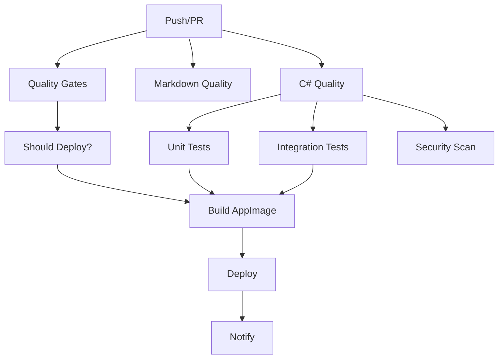

# Overlay Companion (MCP) - Tool Specification

_A general-purpose, human-in-the-loop AI-assisted screen interaction toolkit._

---

## Architecture Overview

The Overlay Companion MCP server is built using the **official ModelContextProtocol C# SDK** from
Microsoft/Anthropic, providing a robust foundation for MCP compliance and integration with the .NET
ecosystem.

### Deployment Architectures

The system supports two deployment architectures to meet different security and operational requirements:

#### 1. Direct stdio Transport (Default)

```text
Jan.ai → stdio → MCP Server (OverlayCompanion)
```

- **Use Case**: Direct integration, minimal latency
- **Security**: Process-level isolation
- **Command**: `dotnet run`

#### 2. HTTP Bridge (Segmented Deployment)

```text
Jan.ai → HTTP → Bridge Server → stdio → MCP Server (OverlayCompanion)
```

- **Use Case**: System segmentation, risk-averse deployments
- **Security**: Network-level isolation, separate control plane
- **Flexibility**: Remote deployment, containerization, network policies
- **Command**: `dotnet run --http` or `dotnet run --bridge`

### HTTP Bridge Benefits

The HTTP bridge provides critical deployment flexibility for enterprise and security-conscious environments:

1. **System Segmentation**: Separates Jan.ai control plane from core MCP server
2. **Network Isolation**: Allows firewall rules and network policies between components
3. **Remote Deployment**: MCP server can run on different machines/containers
4. **Risk Mitigation**: Additional layer of isolation for sensitive operations
5. **Monitoring**: HTTP traffic can be logged, monitored, and audited
6. **Load Balancing**: Multiple MCP server instances behind HTTP bridge

---

## MCP Tool Specification (JSON Format)

```json
{
  "mcp_spec_version": "1.0",
  "name": "overlay-companion-mcp",
  "description": "Public MCP server exposing overlay, screenshot, and input actions for human-in-the-loop UI automation.",
  "tools": [
    {
      "id": "draw_overlay",
      "title": "Draw overlay box",
      "mode": "async",
      "params": {
        "x": { "type": "number" },
        "y": { "type": "number" },
        "width": { "type": "number" },
        "height": { "type": "number" },
        "color": { "type": "string", "optional": true },
        "label": { "type": "string", "optional": true },
        "temporary_ms": { "type": "number", "optional": true }
      },
      "returns": {
        "overlay_id": "string",
        "bounds": { "x": "number", "y": "number", "width": "number", "height": "number" },
        "monitor_index": "number"
      }
    },
    {
      "id": "remove_overlay",
      "title": "Remove overlay",
      "mode": "sync",
      "params": {
        "overlay_id": { "type": "string" }
      },
      "returns": {
        "removed": "boolean",
        "not_found": "boolean"
      }
    },
    {
      "id": "take_screenshot",
      "title": "Take screenshot",
      "mode": "async",
      "params": {
        "region": { "type": "object", "optional": true },
        "full_screen": { "type": "boolean", "optional": true },
        "scale": { "type": "number", "optional": true },
        "wait_for_stable_ms": { "type": "number", "optional": true }
      },
      "returns": {
        "image_base64": "string",
        "width": "number",
        "height": "number",
        "region": "object",
        "monitor_index": "number",
        "display_scale": "number",
        "viewport_scroll": { "x": "number", "y": "number" }
      }
    },
    {
      "id": "click_at",
      "title": "Simulate click",
      "mode": "sync",
      "params": {
        "x": { "type": "number" },
        "y": { "type": "number" },
        "button": { "type": "string", "enum": ["left","right","middle"], "optional": true },
        "clicks": { "type": "number", "optional": true },
        "require_user_confirmation": { "type": "boolean", "optional": true },
        "action_timing_hint": { "type": "object", "optional": true }
      },
      "returns": {
        "success": "boolean",
        "was_confirmed": "boolean"
      }
    },
    {
      "id": "type_text",
      "title": "Emulate typing",
      "mode": "async",
      "params": {
        "text": { "type": "string" },
        "typing_speed_wpm": { "type": "number", "optional": true },
        "require_user_confirmation": { "type": "boolean", "optional": true },
        "action_timing_hint": { "type": "object", "optional": true }
      },
      "returns": {
        "success": "boolean",
        "typed_length": "number"
      }
    },
    {
      "id": "set_mode",
      "title": "Set operational mode",
      "mode": "sync",
      "params": {
        "mode": { "type": "string", "enum": ["passive","assist","autopilot","composing","custom"] },
        "metadata": { "type": "object", "optional": true }
      },
      "returns": {
        "ok": "boolean",
        "active_mode": "string"
      }
    },
    {
      "id": "set_screenshot_frequency",
      "title": "Set screenshot frequency",
      "mode": "sync",
      "params": {
        "mode": { "type": "string" },
        "interval_ms": { "type": "number" },
        "only_on_change": { "type": "boolean", "optional": true }
      },
      "returns": {
        "ok": "boolean",
        "applied_interval_ms": "number"
      }
    },
    {
      "id": "get_clipboard",
      "title": "Get clipboard",
      "mode": "sync",
      "params": {},
      "returns": {
        "text": "string",
        "available": "boolean"
      }
    },
    {
      "id": "set_clipboard",
      "title": "Set clipboard",
      "mode": "sync",
      "params": {
        "text": { "type": "string" }
      },
      "returns": {
        "ok": "boolean"
      }
    },
    {
      "id": "batch_overlay",
      "title": "Draw multiple overlays",
      "mode": "async",
      "params": {
        "overlays": {
          "type": "array",
          "items": {
            "type": "object",
            "properties": {
              "x": { "type": "number" },
              "y": { "type": "number" },
              "width": { "type": "number" },
              "height": { "type": "number" },
              "color": { "type": "string", "optional": true },
              "label": { "type": "string", "optional": true },
              "temporary_ms": { "type": "number", "optional": true }
            }
          }
        },
        "one_at_a_time": { "type": "boolean", "optional": true }
      },
      "returns": {
        "overlay_ids": "array"
      }
    },
    {
      "id": "subscribe_events",
      "title": "Subscribe to UI events",
      "mode": "async",
      "params": {
        "events": { "type": "array", "items": { "type": "string" } },
        "debounce_ms": { "type": "number", "optional": true },
        "filter": { "type": "object", "optional": true }
      },
      "returns": {
        "subscription_id": "string",
        "subscribed": "array"
      }
    },
    {
      "id": "unsubscribe_events",
      "title": "Unsubscribe from events",
      "mode": "sync",
      "params": {
        "subscription_id": { "type": "string" }
      },
      "returns": {
        "ok": "boolean"
      }
    }
  ]
}
```

---

## Detailed Tool Descriptions

### 1. draw_overlay

**Purpose**: Draw a visual overlay box on the screen for highlighting or annotation.

**Parameters**:

- `x` (number, required): X coordinate in screen pixels
- `y` (number, required): Y coordinate in screen pixels
- `width` (number, required): Width of overlay in pixels
- `height` (number, required): Height of overlay in pixels
- `color` (string, optional): Color name or hex code (default: "red")
- `label` (string, optional): Text label to display on overlay
- `temporary_ms` (number, optional): Auto-remove after milliseconds

**Returns**:

- `overlay_id`: Unique identifier for the created overlay
- `bounds`: Actual bounds of the overlay (may be adjusted for screen boundaries)
- `monitor_index`: Index of the monitor where overlay was placed

**Example**:

```json
{
  "method": "draw_overlay",
  "params": {
    "x": 100,
    "y": 200,
    "width": 300,
    "height": 50,
    "color": "blue",
    "label": "Click here",
    "temporary_ms": 5000
  }
}
```

### 2. remove_overlay

**Purpose**: Remove a previously created overlay by its ID.

**Parameters**:

- `overlay_id` (string, required): ID of overlay to remove

**Returns**:

- `removed`: True if overlay was successfully removed
- `not_found`: True if overlay ID was not found

### 3. take_screenshot

**Purpose**: Capture a screenshot of the screen or a specific region.

**Parameters**:
- `region` (object, optional): Specific region to capture `{x, y, width, height}`
- `full_screen` (boolean, optional): Capture entire screen (default: true)
- `scale` (number, optional): Scale factor for image (default: 1.0)
- `wait_for_stable_ms` (number, optional): Wait for UI to stabilize before capture

**Returns**:
- `image_base64`: Base64-encoded PNG image data
- `width`: Image width in pixels
- `height`: Image height in pixels
- `region`: Actual captured region
- `monitor_index`: Monitor that was captured
- `display_scale`: Display scaling factor
- `viewport_scroll`: Current scroll position if applicable

### 4. click_at

**Purpose**: Simulate a mouse click at specified coordinates.

**Parameters**:
- `x` (number, required): X coordinate to click
- `y` (number, required): Y coordinate to click
- `button` (string, optional): Mouse button ("left", "right", "middle", default: "left")
- `clicks` (number, optional): Number of clicks (default: 1)
- `require_user_confirmation` (boolean, optional): Require user confirmation
- `action_timing_hint` (object, optional): Timing hints for the action

**Returns**:
- `success`: True if click was executed successfully
- `was_confirmed`: True if user confirmation was required and given

### 5. type_text

**Purpose**: Simulate keyboard typing of text.

**Parameters**:
- `text` (string, required): Text to type
- `typing_speed_wpm` (number, optional): Typing speed in words per minute (default: 60)
- `require_user_confirmation` (boolean, optional): Require user confirmation
- `action_timing_hint` (object, optional): Timing hints for the action

**Returns**:
- `success`: True if typing was executed successfully
- `typed_length`: Number of characters actually typed

### 6. set_mode

**Purpose**: Set the operational mode of the system.

**Parameters**:
- `mode` (string, required): Mode name ("passive", "assist", "autopilot", "composing", "custom")
- `metadata` (object, optional): Additional mode-specific configuration

**Returns**:
- `ok`: True if mode was set successfully
- `active_mode`: Currently active mode name

**Modes**:
- **passive**: Read-only operations (screenshots, overlays)
- **assist**: Suggests actions, requires confirmation
- **autopilot**: Automated actions with safety checks
- **composing**: Specialized for text composition
- **custom**: User-defined behavior

### 7. set_screenshot_frequency

**Purpose**: Configure automatic screenshot capture frequency.

**Parameters**:
- `mode` (string, required): Frequency mode ("manual", "periodic", "on_change")
- `interval_ms` (number, required): Interval in milliseconds
- `only_on_change` (boolean, optional): Only capture when screen changes

**Returns**:
- `ok`: True if frequency was set successfully
- `applied_interval_ms`: Actual interval applied (may be rate-limited)

### 8. get_clipboard

**Purpose**: Get the current clipboard content.

**Parameters**: None

**Returns**:
- `text`: Current clipboard text content
- `available`: True if clipboard content is available

### 9. set_clipboard

**Purpose**: Set the clipboard content.

**Parameters**:
- `text` (string, required): Text to set in clipboard

**Returns**:
- `ok`: True if clipboard was set successfully

### 10. batch_overlay

**Purpose**: Create multiple overlays in a single operation.

**Parameters**:
- `overlays` (array, required): Array of overlay specifications
- `one_at_a_time` (boolean, optional): Create overlays sequentially vs. simultaneously

**Returns**:
- `overlay_ids`: Array of created overlay IDs

### 11. subscribe_events

**Purpose**: Subscribe to UI events for monitoring.

**Parameters**:
- `events` (array, required): Array of event types to subscribe to
- `debounce_ms` (number, optional): Debounce interval for events
- `filter` (object, optional): Event filter criteria

**Event Types**:
- `mouse_move`: Mouse movement events
- `mouse_click`: Mouse click events
- `key_press`: Keyboard events
- `window_focus`: Window focus changes
- `screen_change`: Screen content changes

**Returns**:
- `subscription_id`: Unique subscription identifier
- `subscribed`: Array of successfully subscribed event types

### 12. unsubscribe_events

**Purpose**: Unsubscribe from previously subscribed events.

**Parameters**:
- `subscription_id` (string, required): Subscription ID to cancel

**Returns**:
- `ok`: True if unsubscription was successful

---

## Error Handling

All tools return standard MCP error responses for:

- **Invalid parameters**: Missing or invalid parameter values
- **Permission denied**: Operation not allowed in current mode
- **System error**: Underlying system operation failed
- **Rate limited**: Too many requests in time window

---

## Security & Safety

### Human-in-the-Loop Controls

- Input simulation requires confirmation in most modes
- Mode-based permission system
- Rate limiting on all operations
- User override capabilities

### Privacy Protection

- All operations are local-only
- Screenshot data can be scrubbed before sharing
- Clipboard access requires explicit permission
- No network communication

### Platform Integration

- Respects system accessibility settings
- Works with screen readers and assistive technology
- Follows platform-specific UI guidelines
- Handles multi-monitor setups correctly

---

## Implementation Roadmap

### High Priority (Core Functionality)

- **Complete AvaloniaOverlayWindow rendering** - Make overlays actually visible
- **Session Stop implementation** - Critical safety feature  
- **Color and text rendering** - Basic overlay functionality

### Medium Priority (Enhanced Features)

- **GUI overlay management panel** - User control and monitoring
- **Multi-monitor support** - Professional deployment requirement
- **Advanced overlay shapes** - Enhanced AI interaction capabilities

### Low Priority (Polish)

- **Overlay animations** - Visual enhancement
- **Interactive overlays** - Advanced interaction modes
- **Overlay templates** - Predefined overlay styles

---

## Versioning Schema

The project follows a **date-based versioning schema** for releases:

### Format: `YYYY.MM.DD[.N]`

- **YYYY**: 4-digit year
- **MM**: 2-digit month (01-12)
- **DD**: 2-digit day (01-31)
- **N**: Optional build number for multiple releases in the same day (starting from 1)

### Examples

- `2024.08.18` - First release on August 18, 2024
- `2024.08.18.1` - Second release on August 18, 2024
- `2024.08.18.2` - Third release on August 18, 2024
- `2024.12.25` - First release on December 25, 2024

### Release Automation

- **Automatic versioning**: GitHub Actions automatically calculate the next version
- **Daily builds**: Each day gets a new base version
- **Multiple builds**: Same-day builds increment the build number
- **GitHub releases**: Automatically created with AppImage artifacts

---

## GitHub Actions & CI/CD

The project includes comprehensive automation through GitHub Actions:

### 1. **Markdown Linting** (`markdown-lint.yml`)
- **Purpose**: Documentation quality assurance
- **Triggers**: Push/PR to main/develop branches (markdown files)
- **Checks**:
  - Markdown syntax and style consistency
  - Spelling accuracy with cspell
  - Link validity verification
  - Table of contents synchronization
- **Tools**: markdownlint-cli, cspell, markdown-link-check

### 2. **C# Linting** (`csharp-lint.yml`)
- **Purpose**: Code quality and build verification
- **Triggers**: Push/PR to main/develop branches (C# files)
- **Checks**:
  - Code formatting verification (`dotnet format`)
  - Build success validation
  - Static analysis
  - Security vulnerability scanning
  - Deprecated package detection
  - Code metrics analysis
- **Artifacts**: Build outputs for verification

### 3. **AppImage Build** (`build-appimage.yml`)
- **Purpose**: Linux distribution package creation
- **Triggers**:
  - Push to main/develop (source changes)
  - Manual workflow dispatch
  - GitHub releases
- **Features**:
  - Automatic version calculation
  - AppImage creation with proper metadata
  - Desktop integration files
  - Artifact upload and testing
  - Automatic GitHub release creation
- **Outputs**: Distributable AppImage files

### 4. **CI/CD Pipeline** (`ci-cd.yml`)
- **Purpose**: Comprehensive continuous integration and deployment
- **Triggers**: Push/PR to main/develop, manual dispatch
- **Stages**:
  - **Quality Gates**: Deployment condition checks
  - **Markdown Quality**: Documentation validation
  - **C# Quality**: Code quality and build verification
  - **Unit Tests**: Automated test execution (when available)
  - **Integration Tests**: Application startup and MCP server testing
  - **Security Scan**: Vulnerability scanning with Trivy
  - **Build AppImage**: Production-ready package creation
  - **Deploy**: Environment-specific deployment
  - **Notify**: Status notifications
- **Environments**: Staging and production deployment support

### Workflow Dependencies



### Quality Standards

- **Zero tolerance**: All quality checks must pass
- **Security first**: Vulnerability scanning on every build
- **Documentation**: Markdown quality enforced
- **Code style**: Consistent formatting required
- **Build verification**: Must compile without errors
- **Testing**: Automated validation where possible

---

## Packaging Artifacts & Ignored Paths

To keep the repository clean and reproducible, packaging outputs are generated at build time and must not be committed.

- The build system writes all packaging outputs under build/ (AppDir tree, AppImage file, publish/ outputs). These are ignored via .gitignore.
- The desktop entry and AppStream metadata are generated by scripts/build-appimage.sh during the build:
  - Desktop file path: AppDir/usr/share/applications/overlay-companion-mcp.desktop
  - AppStream file path: AppDir/usr/share/metainfo/overlay-companion-mcp.appdata.xml
  - Source of truth: Variables and heredoc content inside scripts/build-appimage.sh (APP_NAME, APP_DISPLAY_NAME, APP_DESCRIPTION, APP_CATEGORY, versioning, etc.).
- If you need to edit metadata, update scripts/build-appimage.sh. Optionally, introduce checked-in templates (e.g., packaging/linux/overlay-companion-mcp.desktop.tmpl and packaging/linux/overlay-companion-mcp.appdata.xml.tmpl) and have the script copy them into AppDir at build time.
- Trimming: Disabled by default in src/OverlayCompanion.csproj for stability with Avalonia/reflection. Do not pass /p:PublishTrimmed or TrimMode in workflows or scripts unless you explicitly re-enable trimming in the project.
- AppImage build notes:
  - The script auto-detects dotnet or installs SDK 8 locally via dotnet-install.sh if missing.
  - FUSE-less environments are supported via the extraction-based fallback.
  - You can set APP_VERSION=YYYY.MM.DD prior to running the script to control the output filename.

This policy prevents accidental commits of generated binaries and ensures the build remains deterministic across environments.

---

## AI GUI Tests (AllHands-only)

Purpose: provide a simple, key-free GUI test harness that runs inside the AllHands cloud environment and is not tied to GitHub Actions.

- Location: tests/ai-gui/
- Runner: tests/ai-gui/run.sh (invokes setup, builds app, launches under Xvfb, runs harness)
- Evidence: tests/ai-gui/artifacts/ (screenshots, logs, JSON summary)
- No API keys: uses stdio MCP when available or performs visual smoke tests until MCP is fully wired
- Not part of GitHub Actions by design; run manually in AllHands cloud


